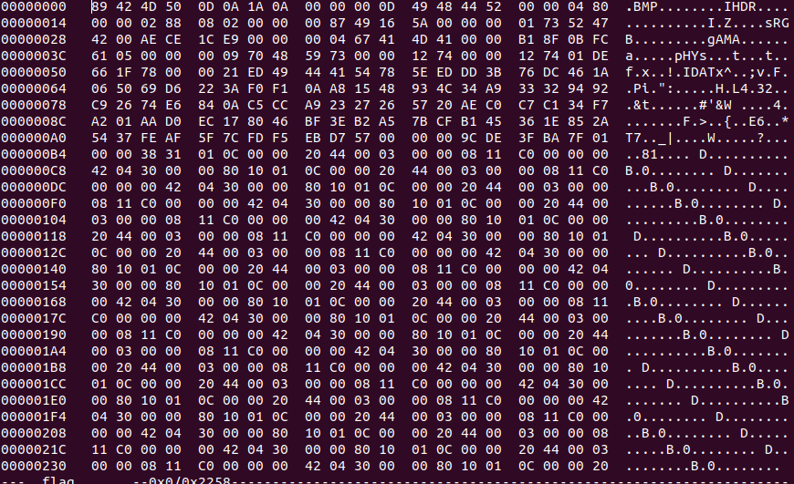
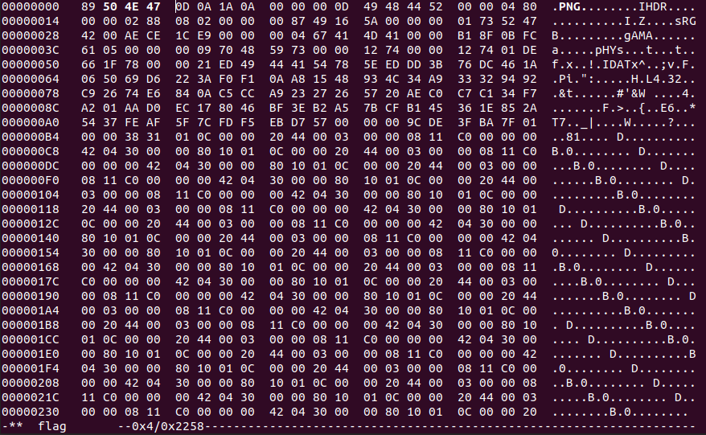
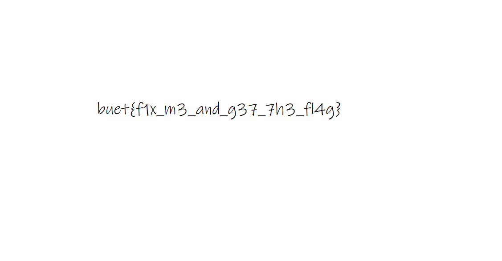

# Readme

---

---

### Challenge title: FixM3

### 

### Points: 200

### 

### Flag: buet{f1x_m3_and_g37_7h3_fl4g}

### Author:

> Tawsif Shahriar

### Solution

---

#### Skills need to solve this problem

1. Editing hex values of files
2. Knowledge about file header signatures
3. Knowledge about PNG,PNG header and fixing corrupt PNG files

#### Process

---

It is a corrupt PNG file.

If we see the hexdump of the file, we see BMP as the file header which is incorrect.

Using hexedit/HxD we correct the header.

Now we can see the flag inside the image.

