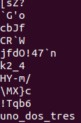
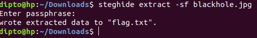

# # Readme

---

---

### Challenge title: Sky

###

### Points: 150

###

### Flag: buet{look_up_to_the_sky_and_see}

### Author:

> Tawsif Shahriar

### Solution

---

#### Skills need to solve this problem

1. Basic steganography knowledge
2. Usage of strings
3. Usage of steghide

#### Process

---

If we run strings on the given jpg file, we can see a suspicious line at the end of the image.

This last string is the needed passphrase for steghide.

Now running steghide with the acquired passphrase, we get the flag.

