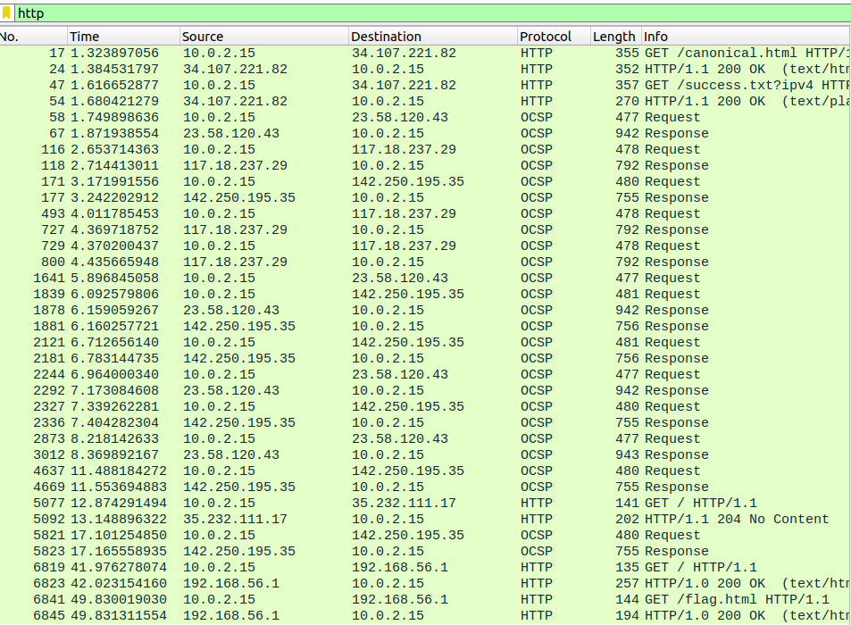
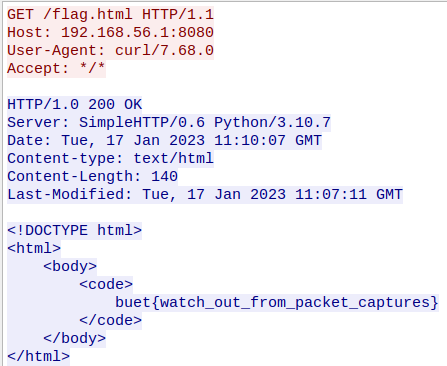

# Readme

---

---

### Challenge title: Sniffer1

### 

### Points: 150

### 

### Flag: buet{watch_out_from_packet_captures}

### Author:

> Tawsif Shahriar

### Solution

---

#### Skills need to solve this problem

1. Wireshark
2. Basic pcap analysis

#### Process

---

We are given a pcap file to analyze. If we filter out only te http protocol packets, we see something interesting at the end.

Following the http protocol corresponding to flag.html, we can see the flag.

