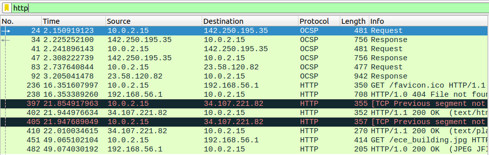

# # Readme

---

---

### Challenge title: Sniffer2

### 

### Points: 100

### 

### Flag: buet{ece_is_sovereign}

### Author:

> Tawsif Shahriar

### Solution

---

#### Skills need to solve this problem

1. Wireshark
2. Basic pcap analysis

#### Process

---

We are given a pcap file to analyze. If we filter out only te http protocol packets, we see something interesting at the end.

We see that, an image was transferred using http protocol.

We can extract the image and see the flag in the image.

