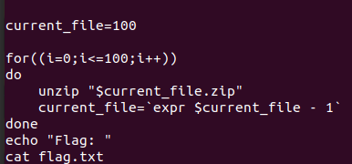

# Readme

---

---

### Challenge title: Zypper

### Points: 150

### Flag: buet{un21p_m3_t0_th3_3nd}

### Author:

> Tawsif Shahriar

### Solution

---

#### Skills need to solve this problem

1. Basic linux
2. Bash/python scriptng

#### Process

---

We are given a file 100.zip. If we extract it, we get 99.zip, then 98.zip and so on.

By the pattern, we can see that it is a recursive zip file.

To automate the extraction, we can write a simple script and can get the flag.

